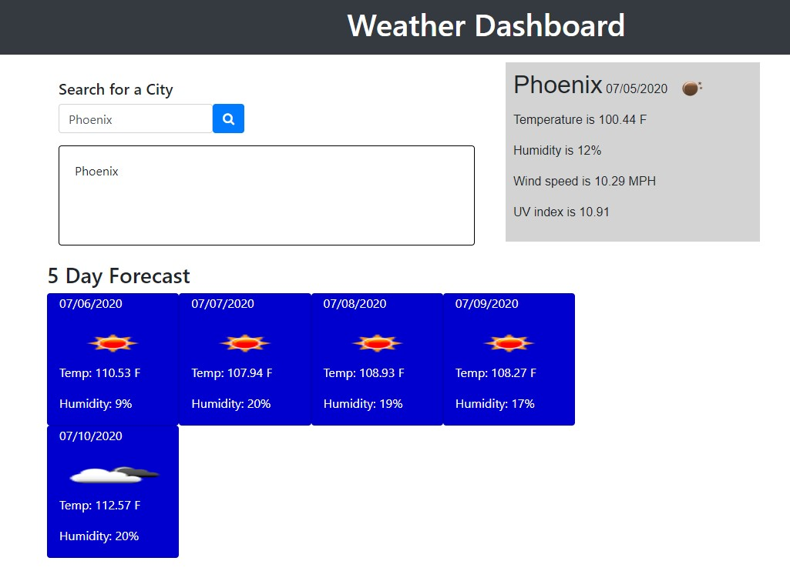
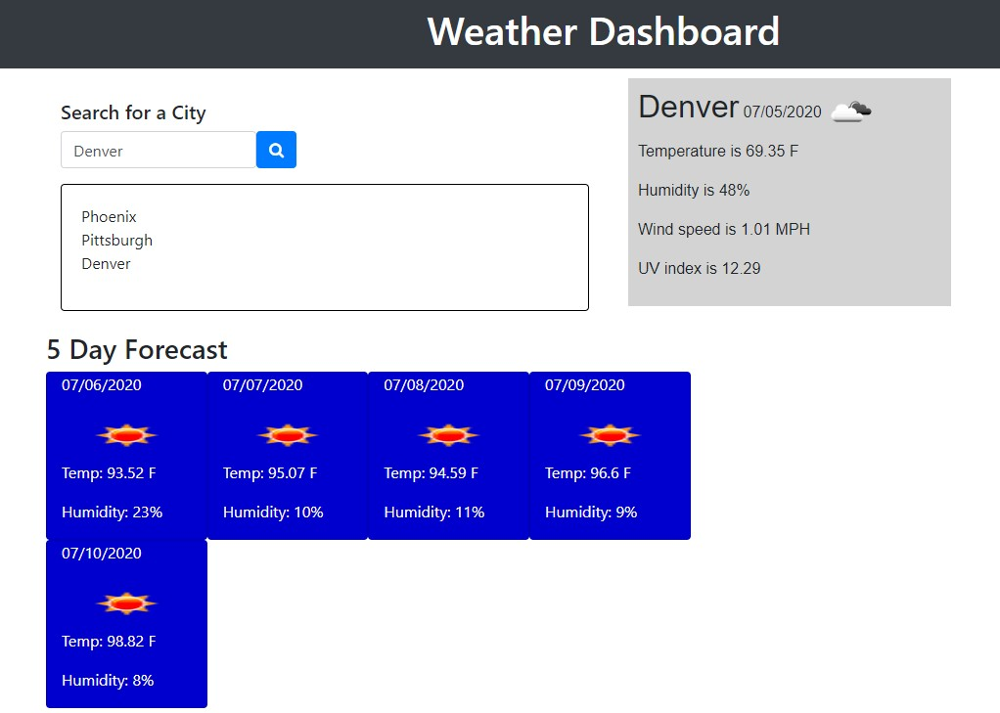
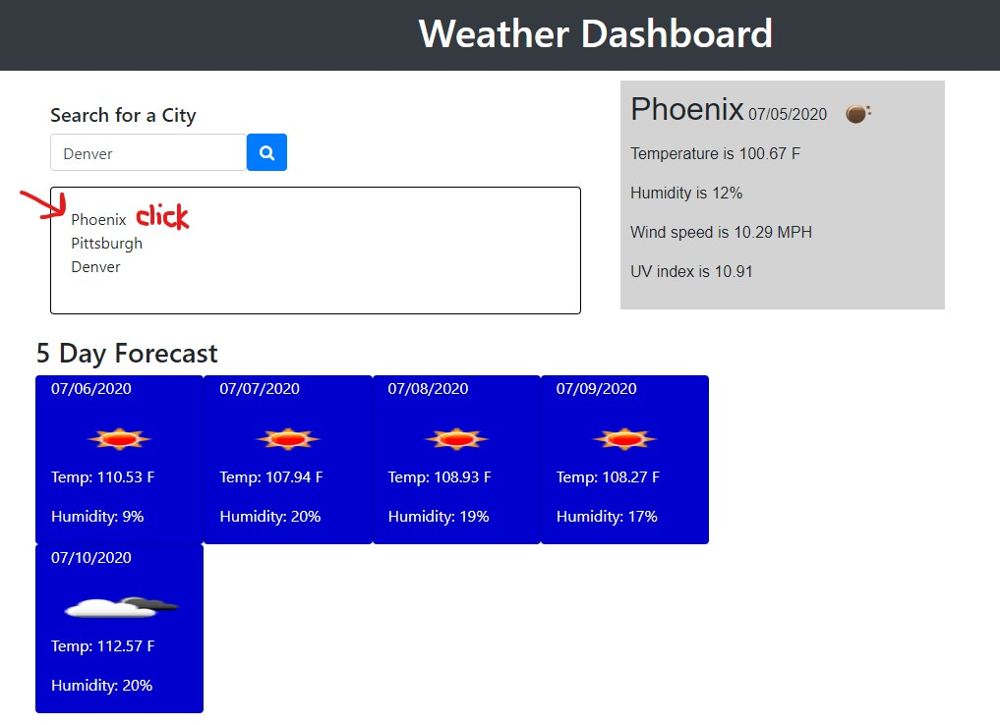

# Unit 7: Project 1

## Overview
Welcome to Project 1! This is an important step in your full-stack journey as you will now use your newly acquired skills and knowledge to build web application from scratch. With your team, you will conceive and execute a design that solves a real-world problem by integrating data received from multiple server-side API requests. Because you will be working collaboratively, you will learn agile development methodologies and implement feature and bug fixes using the git branch workflow and pull requests.

## Key Topics
* Server-side APIs
* Git branching workflow
* Agile software development

## Comprehension Check
You will be employer-ready if you can answer the following questions:
1. What is agile software development?
2. What is an MVP?
3. If you pull down a teammate's branch and you have merge conflicts, how do you handle it?

## Learning Objectives
You will be employer-competitive if you are able to:
* Speak technically about a feature you implemented in your project
* Explain and execute git branching workflow in a collaborative project
* Resolve merge conflicts
* Explain agile software development
* Design, build, and deploy a client-side web application using GitHub Pages
* Prepare a professional presentation and repository README for your project

## Project Requirements

```
* Use a CSS framework other than Bootstrap.
* Be deployed to GitHub Pages.
* Be interactive (i.e: accept and respond to user input).
* Use at least two server-side APIs.
* Does not use alerts, confirms, or prompts (use modals).
* Use client-side storage to store persistent data.
* Be responsive.
* Have a polished UI.
* Have a clean repository that meets quality coding standards (file structure, naming conventions, follows best practices for class/* id-naming conventions, indentation, quality comments, etc.).
* Have a quality README (with unique name, description, technologies used, screenshot, and link to deployed application).


Sample screenshot from the XpensiFI Budget Tracker:




REPOSITORY TITLE: lafry5/Weather-dashboard

    Created code from scratch. Created README.md, index.html, script2.js, style.css and screenshot.jpg files.

Repository Link: https://github.com/lafry5/Weather-dashboard

Github Page: https://lafry5.github.io/Weather-dashboard/.

TABLE OF CONTENTS:
    
    -  Clone
 
    -  Setup
 
    -  Contributing

    -  Description
 
    -  Support

Clone:
    Clone this repo to your local machine using https://github.com/lafry5/Weather-dashboard.git

Setup:
    Ensure that all files are located in the root folder (Index, Readme).

Contributing:
    Assistance was provided from the TAs during office hours for questions on the assignment.

Description:
    This code will provide the weather lookout for a city provided by the user. The user will not only be able to see today's weather outlook (temperature, humidity, wind, UV and overall weather icon), but will also see a five-day forecast for the same city. If the user selects another city for a forecast, the previous city will persist in the list below the search field. If the user wants to go back and see the forecast for a city he/she previously search, then he/she simply needs to click the city in the list below the search field and the forecast will re-appear.  


Example screenshots are as follows:






Support:
    Reach out to me at one of the following places if you have any questions!

    Email: lafry5@yahoo.com 
    Cell: (602) 363-0253

